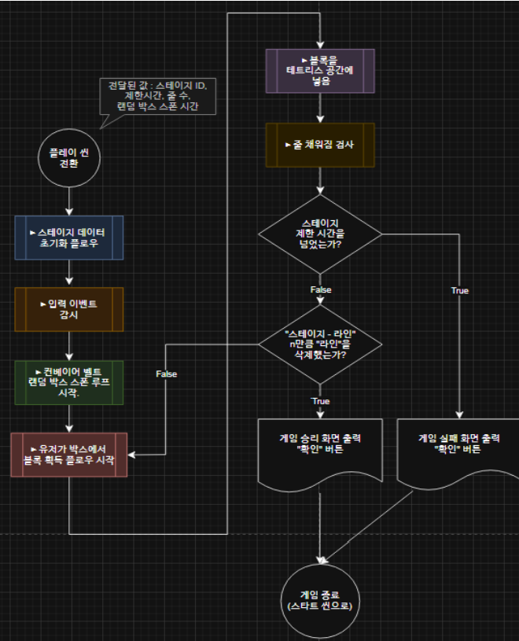

# VR TEMTRIS

> 현실 물리엔진을 적용한  VR 테트리스 게임  
> 버츄얼 하냥이팀 프로젝트 – 가상 및 증강현실 프로그래밍

---

## 프로젝트 개요

- **프로젝트명**: VR 템트리스 (VR TEMTRIS)
- **장르**: 퍼즐 / VR / 캐주얼
- **개발 플랫폼**: Unity + Meta Quest 2
- **요약 설명**:  
  현실의 물리 법칙이 적용된 테트리스를 VR 환경에서 직접 블록을 잡고 조작하며 플레이하는 몰입형 VR 게임입니다.

---

## 팀 구성

| 이름       | 주요 역할 |
|------------|-----------|
| 김현민 (팀장) | 플레이어-VR 상호작용, 프로젝트 총괄 |
| 고호진     | 아이템 시스템 구현 |
| 강정훈     | UI/UX 설계, 사운드 |
| 김경민     | 엔티티 및 배경 구현 |
| 전승환     | 물리 엔진 구현 |

---

## 기획 의도 및 주제 선정 이유

테트리스는 1984년 출시 이후 지금까지도 세계적으로 꾸준히 사랑받고 있는 고전 퍼즐 게임이다. 단순한 규칙 속에서 높은 몰입도와 도전 욕구를 자극하는 구조 덕분에, Not Tetris, Sandtrix 등 다양한 변형작들이 등장해왔다. 우리 팀은 이러한 테트리스를 VR 환경에서 직접 블록을 잡고 배치하는 물류 작업처럼 재해석함으로써, 새로운 플레이 경험을 줄 수 있을 것이라 판단하였다.

VR은 사용자의 몰입감과 실재감을 극대화할 수 있는 플랫폼으로, 물리적인 상호작용이 자연스러울수록 그 효과는 더욱 두드러진다. 우리는 이 특성을 살려 테트리스의 핵심 요소인 블록 회전과 배치 과정을 키보드 입력이 아닌 사용자의 손 움직임과 물리 기반 조작으로 구현하였다.

또한 중력, 충돌, 무게중심 등의 현실 물리엔진을 적용하여 블록 간의 상호작용을 더 사실적으로 표현하였고, 로봇팔 시스템과 아이템 요소를 더해 시간 압박과 전략성을 함께 제공하고자 했다.

---
## 게임의 재해석
기존의 테트리스는 가상의 공간 안에서 떨어지는 블록들을 화면을 바라보며 쌓는 게임이었는데
우리는 가상의 공간 안에 직접 들어가서 현실 세계의 물리법칙을 적용한 블록들을 플레이어가 잘
제어하면서 블록을 놓도록 설계하였다.

- 기존 테트리스의 시간의 흐를수록 블록이 점점 빠르게 생성되는 시스템은 컨베이어 벨트(로봇 팔)를
활용하여 블록이 점점 빠르게 운반되어 테트리스 공간을 떨어지는 설정으로 재해석하였다.

- 또한 기존에 없던 시스템인 아이템 시스템을 도입하여 게임을 더욱 더 재밌게 플레이하고, 플레이를
어려워하는 사용자의 학습 곡선을 완화할 수 있게 설계하였다. 

## 게임 시스템 및 특징

### 주요 게임 흐름
- 로봇팔이 상자를 운반 → 상자 개봉 → 내부 블록을 직접 집어 테트리스 공간에 배치
- 줄이 일정 이상 채워지면 파괴 → 점수 획득 → 아이템 구매 가능
- 제한 시간, 속도 증가, 랜덤 블록 배치 등 전략적 판단 + 빠른 반응 요구

### 핵심 게임 요소

| 요소          | 설명 |
|---------------|------|
| 물리 엔진       | 중력, 관성, 충돌, 무게중심 기반 블록 회전 및 정렬 |
| 로봇팔 시스템   | 제한 시간 내 블록 처리 압박 유도 (시간이 지날수록 속도 증가) |
| 아이템 시스템   | 점수를 사용하여 아이템 구매 가능 |
| 스테이지 & 점수 | 제한 시간 내 줄 삭제 목표, 점수로 난이도/보상 제어 |
| 블록 파괴      | 줄의 90% 이상이 채워지면 파괴 발생 |

### 플로우 차트

## 주요 특징

아이템 시스템:  
- 글루:
서로 다른 블록 두 개 이상을 하나로 붙여 큰 덩어리 블록으로 만들 수 있다. 불안정하게 놓인 블록을 고정하거나, 공백을 효과적으로 채우는 데 유용하다.

- 블록 슬라이스:
사용자가 원하는 모양의 블록을 직접 선택·구매할 수 있다. 필요할 때 원하는 형태를 확보하여 전략적으로 게임을 운영할 수 있게 해준다.

지우개
지우개 오브젝트에 닿은 블록을 즉시 제거할 수 있는 아이템이다. 특정 위치의 블록을 정리하거나, 공간을 재구성할 때 유용하게 사용할 수 있다.

로봇팔:
- 시간 압박 요소 구현:
로봇팔은 시간이 지날수록 속도가 점점 빨라지며, 플레이어에게 실질적인 압박감을 준다. 이는 기존 테트리스의 속도 상승 요소를 VR 환경에서 시각적으로 재현한 것이다.

- 블록 사전 확인 및 전략적 처리:
플레이어는 로봇팔이 전달하는 상자를 직접 열어 다음 블록을 미리 확인할 수 있다. 여유가 있을 때 밀린 큐를 먼저 처리함으로써 시간적 여유를 확보하는 등, 보다 계획적인 플레이를 유도한다.

물리엔진:
- 현실 기반 상호작용:
블록 간의 충돌, 중력, 무게중심 등의 요소를 반영하여, 블록이 실제처럼 회전하거나 쓰러질 수 있도록 구현하였다.

- 불규칙한 블록 파괴 연출:
블록은 일정한 칸 단위가 아닌, 적재된 방향과 형태에 따라 불규칙하게 잘리거나 무너진다. 이러한 특성은 게임 전개를 더욱 다이내믹하고 예측 불가능하게 만든다.

## 플레이 시나리오
1. 게임 시작 & 초기 화면

- 플레이어는 VR 기기를 착용한 상태로 게임을 실행하며, 가상 공간에 진입한다.
- 초기 화면에는 Start Menu와 Settings 버튼이 공중에 떠 있는 형태로 배치되어 있으며, 플레이어는 양 손 컨트롤러를 통해 버튼을 직접 가리키고 클릭할 수 있다.
- Start Menu를 선택하면 게임이 시작되며, Settings를 통해 그래픽/조작 옵션 등을 사전 설정할 수 있다.

2. 튜토리얼 맵 진입

- 첫 스테이지는 튜토리얼 형식으로, 플레이어가 VR 공간에서 블록을 잡고 옮기는 방법, 회전시키는 방식 등을 학습할 수 있도록 구성된다.
- XR Interaction Toolkit 기반으로 제공되는 XR Device Simulator를 통해 시야 회전, 컨트롤러 조작, 이동 등을 익힐 수 있다.

3. 로봇팔과 상호작용

- 일정 시간이 지나면 로봇팔이 등장해 상자가 실린 블록을 플레이어 앞으로 이동시킨다.
- 플레이어는 상자를 열어 내부 블록을 확인하고, 그 블록을 집어 테트리스 필드에 직접 배치해야 한다.
- 손의 움직임과 위치에 따라 블록이 중력과 관성에 의해 회전하거나 기울어질 수 있으므로, 안정적으로 배치하려면 적절한 조작이 요구된다.

4. 게임 진행

- 줄이 일정 이상 채워지면 자동으로 제거되며, 점수가 누적된다.
- 누적된 점수로는 **아이템(글루, 블록 주문, 폭탄 등)**을 구매할 수 있으며, 적절한 타이밍에 사용하여 난이도 조절 및 위기 탈출이 가능하다.
- 로봇팔의 속도는 시간이 지날수록 점점 빨라지며, 플레이어는 긴장감 속에서 빠르게 판단하고 조작해야 한다.

5. 스테이지 클리어 및 다음 단계
- 각 스테이지는 제한 시간 내에 특정 줄 수를 제거하는 것이 목표이며, 목표 달성 시 다음 단계로 진행된다.

---

## 마일스톤 구성   
기획 단계
- 게임 콘셉트 및 시스템 기획
- 기능별 요구사항 정의 및 플로우 차트 작성

프로토타입 단계
- 기본 UI/UX 구현
- VR 인터랙션 및 물리엔진 테스트
- 핵심 게임플레이 구성 (블록 생성, 조작, 배치)

데모 버전 개발
- 엔티티 디자인 및 블록 모델링
- 아이템 시스템, 배경음악/효과음 적용
- 스테이지 구성 및 최적화
- 리소스 배치 및 위험요소 대응

## 테스트 및 QA

- **단계별 기능 테스트**: 각 기능이 완성될 때마다 즉시 테스트를 진행하여 정상 동작 여부를 확인하였고, 구현 내용은 커밋 로그와 함께 기록하였다. 이를 통해 기능 단위에서 안정성을 확보했다.
- **통합 테스트**: 개별 기능 간의 연동이 정상적으로 작동하는지 점검하고, 전체 흐름이 기획된 요구사항에 부합하는지를 확인하였다.

---
## 향후 계획

- **트롤링 오브젝트** 도입 (휴지, 공 등 전략 방해 요소)
- **예기치 못한 이벤트** (장애물, 속도 변화 등)
- **멀티플레이 지원 고려** (협동 or 경쟁 기반 플레이)

---

