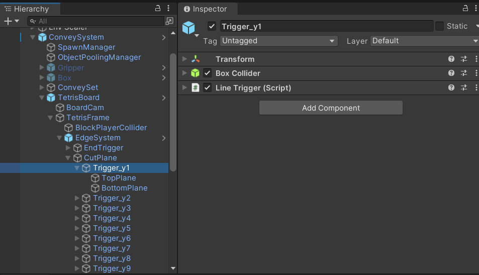
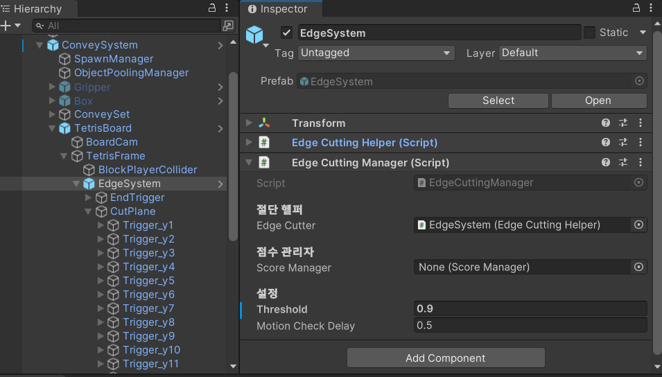
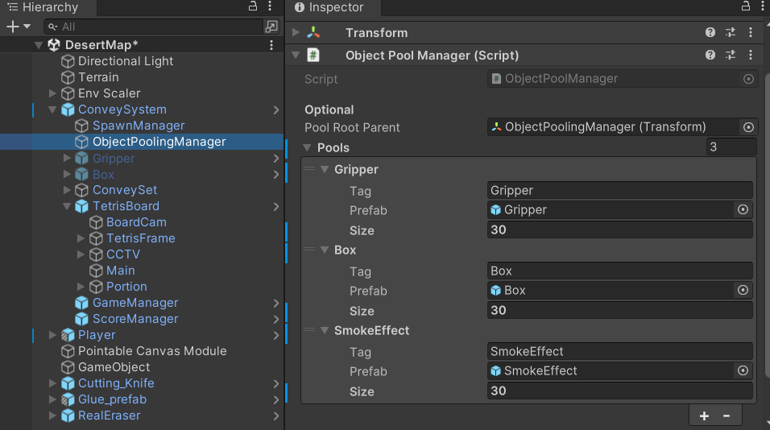
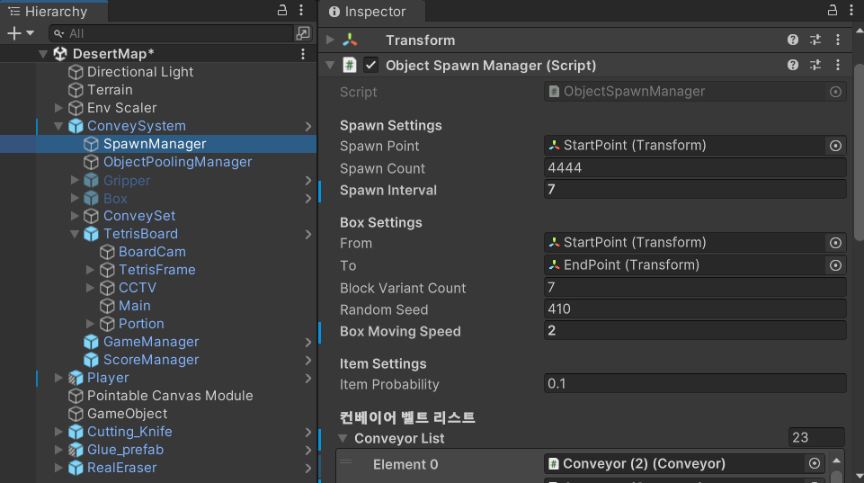
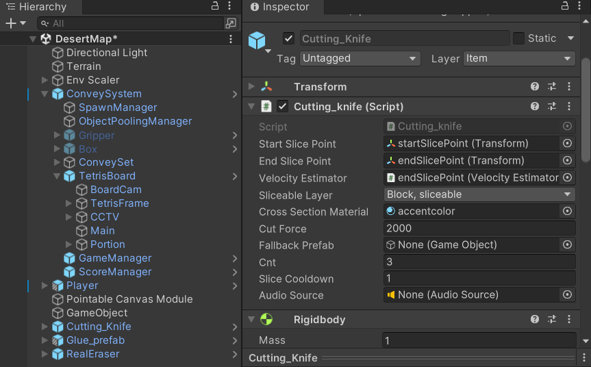
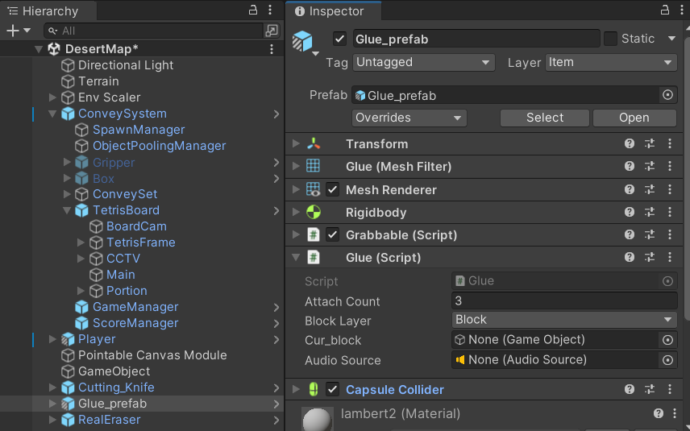
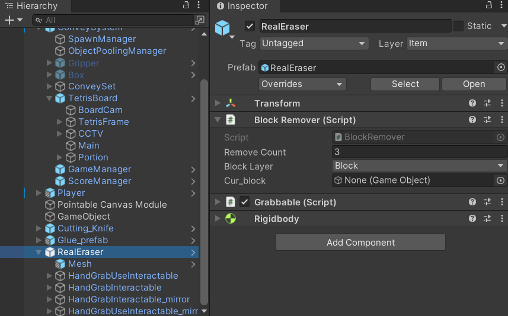

## VR Temtris DevelopGuide

---

### 1. 시스템 - 절단 시스템 (Edge Cutting System) - 전승환

* [BoxCollider 내부 감지] → LineTrigger.cs  
└ 점유율 계산 + 정지 여부 체크  
→ 조건 만족 시 RequestCut 호출  

* [절단 요청] → EdgeCuttingManager.cs  
└ 블럭 점유율 판단 → 삭제 or 절단

* [절단 실행] → EdgeCuttingHelper.cs  
└ 절단 성공 시 Upper 유지, Lower 제거  
└ 절단 이펙트 출력, 점수 증가  

* (선택적) BlockSliceInfo.cs를 통해 블럭 교체 => 현재는 잘린 오브젝트를 생성할 때 정보를 가져오는 용도로 사용 중

* 구현 방식: 트리거의 중심 Y값 기준으로 X축 방향의 점유 면적을 계산하는 평면 기반 방식 도입,  
    점유율 계산은 단일 Y값의 절단 평면을 기준으로 블럭들의 X방향 면적 범위만을 2D 방식으로 계산한다.

* 배치 방법:

└ 해당 오브젝트는 TetrisBoard.Prefab에 구현되어 있습니다.
└ 1. 절단을 관리할 오브젝트에 EdgeCuttingHelper.cs, EdgeCuttingManager.cs를 부여한다.
└ 2. 해당 오브젝트의 자식으로 BoxCollider, LineTrigger.cs를 배치한다.
└ 3. 절단면의 기준이 될 Plane을 설치하여 윗 면과 아랫 면을 배치한다.
└ 4. BoxCollider로 삭제하고 싶은 Line에 맞게 크기를 조절한다.
└ 5. 삭제하고 싶은 오브젝트에 Block Layer를 설정해주면 완성.

---

### 2. 시스템 - 점수 시스템 (Score System) - 김현민

* [절단 성공] → EdgeCuttingManager.cs  
└ ScoreManager.AddScore(10) 호출
 
* [점수 누적] → ScoreManager.cs  
└ currentScore 증가  
└ OnScoreChanged 이벤트 발송

* [UI 반영] → GetScore.cs  
└ OnEnable 시점에 현재 점수 불러와 텍스트로 표시  
└ levelAmount 수동 설정(스테이지 표시용)

* 구현 방식 : 
└  옵저버 패턴의 delegate와 싱글톤으로 작성되어 점수를 획득 시킬 LineTrigger.cs에 RequestCut시에만 작동하게 만들었습니다. 
 
* 사용 방식 :
└  ScoreManager.Instance.OnScoreChanged += HandleScoreChanged;로 사용시킬 메소드에 추가시켜주면 됩니다.
 

---

### 3. 블록 및 아이템 스폰 시스템 - 고호진

##### 3.1. 시스템 - 오브젝트 생성 및 풀링 

* [오브젝트 풀 생성] → `ObjectPoolManager.cs`  
└ 설정 된 오브젝트를 설정 된 갯수만큼 생성하여 풀 형성

* [주기적 Gripper 소환] → `ObjectSpawnManager.cs`/`StartCoroutine(SpawnGrippersWithInterval())`  
└ 풀에서 `상자` 와 `기계 손` 오브젝트 생성

* [Box 초기화 및 셔플] → `ObjectSpawnManager.cs`/ `CreateNewBag()`  
└ 7-Bag 기반 무작위 블록 인덱스 생성  
└ 아이템 등장 확률(itemProbability)에 따라 블록 or 아이템 결정
└ 단, 마지막 보드에 떨어뜨릴때에는 아이템이 생성되면 안되니 예외처리로 무작위 블록 생성.

* 구현 방식 : 
└ 싱글톤으로 작성된 ObjectPoolManager.cs에서 생성할 오브젝트를 할당해줍니다.
└ 각 리스트의 할당된 아이템들은 태그와 프리팹을 기준으로 검색합니다.
└ 태그를 기준으로 탐색하여 아이템을 풀에 만듭니다.

##### 3.2. 시스템 - 상자와 기계 손

* [기계 손 이동 설정] → `Gripper.cs + PathFollower.cs + SpawnManager.cs`  
└ Gripper가 박스를 `Grab()`  
└ `SetRandomOpenPoint()`로 상자가 강제로 열리는 포인트 설정 후 Waypoint 따라 이동  
└ 목표 지점 도달 시 `OpenBoxIfHolding()` 호출 → `BoxOpen.ForcedOpen()`으로 강제로 박스가 열림
└ 컨베이어 리스트들의 위치는 Conveyor.cs로 각 이동경로에 설치된 친구들을 가져옵니다.

* [상자 오픈] →  `BoxOpen.cs`  
└ 플레이어의 Trigger로 인한 오픈 or 기계 손에 의한 강제 오픈  
└ 강제 오픈 시 블럭에 랜덤한 Z축 회전이 들어감.

---

### 4. 아이템 - 절단 나이프 (VR Cutting Knife System) - 전승환

* [손 움직임 기반 칼끝 이동] → startSlicePoint ~ endSlicePoint  
└ Linecast로 sliceable 블럭 탐지  
└ 감지 시 Slice() 실행

* [Slicing] → Cutting_knife.cs, SliceUtility.cs  
└ velocity와방향 벡터로 절단 평면 계산  
└ EzySlice로 Upper / Lower 생성  
└ Lower는 제거, Upper는 유지
└ 잘린 오브젝트는 SliceUtility.cs에 구현되어 여러 component들을 설정해줍니다.

* [속도 계산] → VelocityEstimator.cs  
└ 손의 움직임을 기반으로 velocity, angular velocity 추정  
└ 절단 평면 방향에 핵심적으로 사용 
 
* 구현 방식 : 
└ startPoint와 endPoint를 자식으로 부여해 위치를 설정해주고,
└ 해당 부분에 맞닿은 오브젝트와 그때의 힘을 계산하여 EzySlice.cs와 SliceUtility.cs의 함수를 호출합니다.
└ SliceUtility.cs에 잘려서 생성된 오브젝트에 부여해줄 컴포넌트와 여러 위치를 설정합니다.

* 사용 방식 : 
└ Cutting_Knife.prefab으로 저장되어 있으며 사용하면 됩니다. 
└ Cutting_knife.cs를 사용할 칼 에셋에 부여해주고, 자식으로 StartSlicePoint와 endSlicePoint로 빈 오브젝트를 생성해줍니다.
└ Rigidbody도 추가적으로 부여 해줍니다.
└ 그 후 Cutting_knife의 레퍼런스에 맞게 잘린 부분에 부여해줄 머터리얼과 반응할 레이어, 반응할 역치의 힘 등을 설정해줍니다.

---

### 5. 아이템 - 풀 : 블록 연결 시스템 (Glue Item System) - 고호진 

* [블럭 충돌 시 연결 시도] → `AttachableOnCollision.cs`  
└ `canAttach == true` 상태에서 충돌 발생  
→ `BlockConnectHelper.ConnectByCollision()` 호출

* [면 추출 및 판별] → `BlockConnectHelper.cs`  
└ 각 블록의 `BoxCollider` 면 중심 및 법선 계산  
└ 반대방향 면(dot product 기반) 추출하여 offset 계산  
└ Z축 방향 제외하고 회전 정렬

* [블럭 위치 정렬 및 연결] → `BlockConnectHelper.cs`  
└ 위치 offset만큼 이동 → `FixedJoint` 생성  
└ `blockB`를 `blockA`의 자식으로 설정

* [아이템 기능 발동] → `BlockAttacher.cs`  
└ 충돌 시 `canAttach = true` 설정  
└ `attachCount`만큼 사용 후 아이템(자신) 삭제

* 구현 방식 : 
└ 블럭의 BoxCollider의 면을 추출하여 법선을 계산하면 면이 어디를 바라보고 있는 지 알 수 있다.  
└ 블럭이 서로 붙으려면 면과 면이 마주봐야하므로 각 블럭의 면의 법선이 반대인 쌍 중에 가장 가까운 한 쌍을 고른다.  
└ 이 한 쌍의 면의 점과 점 사이의 거리인 offset과 두 블럭의 중심을 계산하여 블럭을 이동시킨다.

* 사용 방식 :
└ 해당 아이템 오브젝트는 Glue_prefab에 설정되어 있습니다.
└ Grab을 누른 채로 Trigger버튼을 누르면 콜라이더에 맞붙은 오브젝트에 풀을 붙입니다.

---

### 6. 아이템 - 지우개 : 블록 삭제 시스템 (Eraser Item System) - 고호진

* [블럭과 충돌 시 제거] → `BlockRemover.cs`  
└ 충돌한 블럭의 `AttachableOnCollision.DetachFromParent()` 호출  
└ `Destroy(other)`로 블록 삭제

* [물리 관계 정리] → `AttachableOnCollision.cs`  
└ `FixedJoint` 제거  
└ 부모-자식 관계 분리 (`transform.SetParent(null)` 등)

* [자신의 사용 횟수 감소] → `BlockRemover.cs`  
└ `removeCount`만큼 사용 후 아이템(자신) 삭제

* 사용 방법  
└ RealEraser.prefab에 구현되어 꺼내 사용하면 됩니다.
└ 방식은 풀과 같은 방식입니다.
└ 닿는 오브젝트를 Destory 시킵니다.

---

### 7. 시스템 - 씬 및 맵 시스템 - 김현민, 김경민

* [스테이지 선택 항목] → `StageNode.cs`  
  └ 씬 이름, 스테이지 설정(`StageDataSO`), 씬 로더(`SceneLoaderSO`) 보유  
  → `OnSelectStage()` 호출 시 씬 전환 및 스테이지 데이터 설정

* [씬 전환 실행] → `SceneLoaderSO.cs`  
  └ 지정된 씬 이름과 스테이지 데이터로 LoadScene 수행

* [페이드 연출] → `ScreenFader.cs`  
  └ Fade 이미지의 알파값 조정으로 부드러운 씬 전환 연출  
  → 페이드 아웃하고 씬 로드 후, 자동으로 페이드 인

* [스테이지 설정 정보] → `StageDataSO.cs`  
  └ blockSpawnInterval (기계 손 생성 간격)  
  └ randomSeed (배치 시드)  
  └ timeLimit (제한 시간)  
  └ pointGoal (목표 점수)

---

### 8. 테트리스 보드 시각화 시스템 - 김현민

* [카메라 위치 조정] → `BoardCam.cs`
  └ 목표 mesh 참조 시, 자동으로 padding과 fov 계산하여 배치됨
  → `TetrisBoard.Prefab` 배치 시, 자동 배치

* [렌더링 화면 스케일 조정] → `BoardScreen.cs`
  └ 연결된 카메라가 생성하는 `Camera.targetTexture`의 해상도를 참조해 가로세로 비율 계산
  → Plane 스케일을 aspect 비율로 자동 조절하여 왜곡 없는 렌더링 출력

* [점유율 큐브(Portion) 생성 및 업데이트] → `LineTrigger.cs`
  └ 라인 삭제 판정에 사용되는 Trigger에서 각 칸의 점유율 계산
  → 해당 값에 따라 Portion 큐브의 색상(Material) 및 크기(Scale)를 실시간 조정
  → 시각적으로 어떤 라인이 얼마나 찼는지 확인 가능

---

### 9. 키 바인딩 시스템 - 강정훈, 김현민

* [UI 토글] → `HandUIManager.cs`
  └ `leftController`, `head`, `uiWindowPrefab`, `showButton` 연결
  └ 버튼 누르면 손에 UI 생성, 다시 누르면 UI 비활성화

* [버튼 입력] → `showButton`
  └ XR Interaction Toolkit의 Input System 사용
  → 기본 설정: Y 또는 B 버튼 (Secondary Button)

---

### 10. UI - 인터페이스 구성 - 강정훈

* [시작 인터페이스] → `FixedGameMenuManager.cs`  
  └ 플레이어 머리 방향 기준으로 메뉴 위치 고정  
  → `HierarchicalMenuController.cs`를 통해 계층형 메뉴 생성

* [계층 메뉴 생성] → `HierarchicalMenuController.cs`  
  └ `MenuNode` 트리를 기반으로 Panel + Button 프리팹으로 인터페이스 구성  
  → 버튼 클릭 시 하위 패널 생성 or 이벤트 실행

* [오브젝트 정보 연결] → `ItemInfoHolder.cs`  
  └ `ScriptableObject(ItemInfo)` 참조를 통해 오브젝트 설명 정보 저장

* [UI 생성 및 표시] → `ShowInfoOnGrab.cs`  
  └ Grab 시 UI 프리팹 생성 및 UIAnchor에 부착  
  → 버튼 입력으로 UI 토글 (표시/숨김 전환)  
  → `UIDisplay.cs`에 ItemInfo 데이터 전달 

---

### 11. 중요 프리팹 구성

#### 11.1. Block Prefab (I, J, L, O, S, T, Z)
    Block_N (Prefab Root)  [Tag: Block, Layer: Block]
    ├── Transform
    ├── MeshFilter (Mesh: Cube.003)
    ├── MeshRenderer (Material: Mat_Block_J)
    ├── Rigidbody (Mass: 1, Use Gravity: ✔)
    ├── BoxCollider
    ├── BoxCollider
    ├── BoxCollider
    ├── BlockSliceInfo (Slice Replacement Prefab: None)
    └── AttachableOnCollision
        ├── CanAttach: false
        └── Block Layer: Nothing

#### 11.2. Box.prefab

    Box (Prefab Root) [Tag: Box, Layer: Default]
    ├── Transform
    ├── MeshFilter 
    ├── MeshRenderer (Material: 박스 외형 재질)
    ├── Rigidbody (Use Gravity: ✔, isKinematic: Gripper에 따라 변화)
    ├── BoxCollider
    ├── Animator (열림 애니메이션)
    ├── XRGrabInteractable (플레이어가 손으로 잡을 수 있음)
    │   ├── selectEntered → OnSelectEntered() : 플레이어에 의해 잡힘
    │   ├── selectExited → OnSelectExited() : 플레이어가 놓음
    │   └── activated → OnTriggerActivated() : 트리거로 열기 시도
    ├── BoxOpen (Script)
    │   ├── itemPrefabs: 생성 가능한 아이템/블록 프리팹 배열
    │   ├── itemSpawnPoint: 내부에서 블록 생성 위치
    │   ├── ForcedOpen(): Gripper 도착 시 강제 열기
    │   └── TryOpen(): 사용자 입력 시 열기
    └── 기타: 
        ├── isOpened: bool (이미 열렸는지 여부)
        ├── heldByGripper: bool (Gripper가 붙잡고 있는지)
        └── holdingGripper: Gripper 참조

#### 11.3. Gripper.prefab

    GripperTemp (Prefab Root) [Tag: Gripper, Layer: Default]
    ├── Transform
    ├── Gripper (Script)
    │   ├── Hold Point: (Transform) 박스가 붙는 위치
    ├── PathFollower (Script)
    │   ├── Speed: 2
    └── Rigidbody

#### 11.4. Cutting_knife.prefab

    Cutting_Knife (Root)
    ├── Transform
    ├── Cutting_knife (Script)
    │   ├── Start Slice Point: startSlicePoint (Transform)
    │   ├── End Slice Point: endSlicePoint (Transform)
    │   ├── Velocity Estimator: endSlicePoint에 부착
    │   ├── Sliceable Layer: Block, sliceable
    │   ├── Cross Section Material: Mat_Block_Z
    │   ├── Cut Force: 1000
    │   └── Fallback Prefab: None
    ├── Knife (Mesh Object)
    │   ├── MeshFilter (Mesh: SW07)
    │   ├── MeshRenderer (Material: Sword7_Material_Red)
    │   ├── MeshCollider (Convex: ✔)
    │   └── Rigidbody (Use Gravity: ✔)
    └── XRGrabInteractable
        ├── Gaze Interaction 설정
        ├── Throw On Detach (Velocity Scale: 1.5)
        └── Interaction Layer Mask: Default

#### 11.5. Glue_prefab.prefab

    Glue_prefab (Root)
    ├── Transform
    ├── Rigidbody
    ├── Collider (Trigger 또는 Box)
    └── BlockAttacher (Script)
        ├── Attach Count: N (붙일 수 있는 횟수)
        └── Block Layer: Block

#### 11.6. Eraser.prefab

    Eraser (Root)
    ├── Transform
    ├── Rigidbody
    ├── Collider (Trigger 또는 Box)
    └── BlockRemover (Script)
        ├── Remove Count: N (삭제 가능한 횟수)
        └── Block Layer: Block

#### 11.7. ItemInfoUI.prefab

    ItemInfoUI (Prefab Root) [Tag: Untagged, Layer: UI]  
    ├── Transform  
    ├── Canvas  
    │   ├── Render Mode: World Space  
    │   ├── CanvasScaler  
    │   └── GraphicRaycaster  
    ├── Panel (UI Panel Background)  
    │   ├── RectTransform  
    │   ├── Image (Background)  
    ├── Text_Title (UI)  
    │   ├── RectTransform  
    │   ├── Text (Title Binding용)  
    ├── Text_Description (UI)  
    │   ├── RectTransform  
    │   ├── Text (Description Binding용)  
    └── ItemInfoUI.cs  
        ├── titleText: Text_Title  
        ├── descriptionText: Text_Description  
        └── SetItemInfo(ItemInfo info): ScriptableObject로부터 UI 텍스트 갱신       

#### 11.8. PanelUI.prefab

    PanelUI (Prefab Root) [Tag: Untagged, Layer: UI]  
    ├── Transform  
    ├── Canvas  
    │   ├── Render Mode: World Space  
    │   ├── CanvasScaler  
    │   └── GraphicRaycaster  
    ├── Background  
    │   ├── RectTransform  
    │   ├── Image (메뉴 배경 스타일 적용)  
    ├── ButtonGroup  
    │   ├── RectTransform  
    │   └── Button (복수 개 배치 가능)  
    │       ├── Image  
    │       ├── Text (버튼 라벨용)  
    │       └── Button 이벤트  
    └── HierarchicalMenuPanel.cs  
        ├── parentPanel: 상위 패널 참조  
        ├── childPanelPrefab: 하위 메뉴용 PanelUI 참조  
        ├── nodeData: MenuNode 데이터 참조  
        └── Setup(MenuNode): 계층 구조에 따라 버튼 및 하위 패널 생성

#### 11.9. GameManager.prefab

    GameManager (Prefab Root) [Tag: Untagged, Layer: Default]  
    ├── Transform  
    └── GameManager (Script)  
        ├── stageData: StageDataSO  
        ├── sceneLoader: SceneLoaderSO  
        ├── fade: ScreenFader  
        ├── scoreManager: ScoreManager  
        ├── gameUI: GameUIController  
        └── gameState 관리: Init, Start, End 전환 로직 포함  

#### 11.10. ScoreManager.prefab

    ScoreManager (Prefab Root) [Tag: Untagged, Layer: Default]  
    ├── Transform  
    └── ScoreManager (Script)  
        ├── currentScore: int  
        ├── OnScoreChanged: UnityEvent<int>  
        └── AddScore(int): 점수 증가 및 이벤트 발송  

#### 11.11. ConveySystem.prefab

    ConveySystem (Prefab Root) [Tag: Untagged, Layer: Default]  
    ├── Transform  
    └── ConveySystem (Script)  
        ├── conveyPoints: Transform[]  
        ├── speed: float  
        └── Move() 함수로 오브젝트 전달  

#### 11.12. EdgeSystem.prefab

    EdgeSystem (Prefab Root) [Tag: Untagged, Layer: Default]  
    ├── Transform  
    ├── EdgeCuttingManager (Script)  
    │   ├── RequestCut(): 절단 요청  
    │   └── AddScoreOnCut(): 절단 성공 시 점수 추가  
    └── EdgeCuttingHelper (Script)  
        ├── PerformCut(): 실제 절단 로직  
        └── SliceEffect(): 이펙트 출력  

#### 11.13. System.prefab

    System (Prefab Root) [Tag: Untagged, Layer: Default]  
    ├── Transform  
    ├── VelocityEstimator (Script)  
    │   ├── GetVelocity(), GetAngularVelocity()  
    ├── ObjectPoolManager (Script)  
    │   ├── RegisterPool(), GetObjectFromPool()  
    ├── ObjectSpawnManager (Script)  
    │   ├── SpawnGrippersWithInterval()  
    │   └── CreateNewBag(): 7-Bag 블록 순서 생성  
    └── ScoreManager, KnifeManager 등 참조 포함  

---

### 8. 외부 라이브러리

**EzySlice - 전승환** 
* 간단 설명: 3D Mesh 오브젝트를 두 부분으로 나누고, 절단된 단면에 자동으로 메시와 머티리얼을 생성해주는 오픈소스 메시 절단 라이브러리
* GitHub: [https://github.com/DavidArayan/EzySlice](https://github.com/DavidArayan/EzySlice)
* 사용된 기능:

  * `Slice()`: 오브젝트를 둘로 자름
  * `CreateUpperHull()`, `CreateLowerHull()`: 절단된 두 결과물 생성
  * `crossSectionMaterial`: 사용자가 지정한 머티리얼로 단면 머티리얼 설정
  * `SliceUtility.SetupSlicedPart()`: 절단된 블럭 후처리 사용

**Meta All in one SDK - 김현민**
* 간단 설명 : VR을 사람과 연결해주는 Meta에서 제공해주는 라이브러리.
* 사용된 기능 : 

  * `XRPLayerController, XRCameraRig` : VR사용자의 컨트롤러와 게임 오브젝트를 연결해줌. 여러 기본 컨트롤러의 모습과 손의 모습, interactor가 구성되어 있음.
  * `Grabbable` : Grab : 오브젝트에 부여하여 잡을 수 있게 만들어주는 상위 코드.
  * `HandGrabInteractable` :  Grabbable이 부여된 오브젝트에 Grab : 어떻게 잡을지, 손가락은 몇개를 사용할지 등을 설정하는 코드.
  * `HandGrabUseInteractable` :  Grabbable이 부여된 오브젝트에 Trigger : Use를 구현해주는 코드.
  * `SecondaryInteractorFilter` :  HandGrabInteractable과 HandGrabUseInteractable이 같이 구현된 상태에서 순서를 강제하는 코드. -> Grab후 Trigger가 작동하도록 순서를 만들어줌.
  * `HandGrabPose` : 손의 형태를 제공하여 물체를 Grab했을때 보여지는 손의 모습을 강제함. 
---